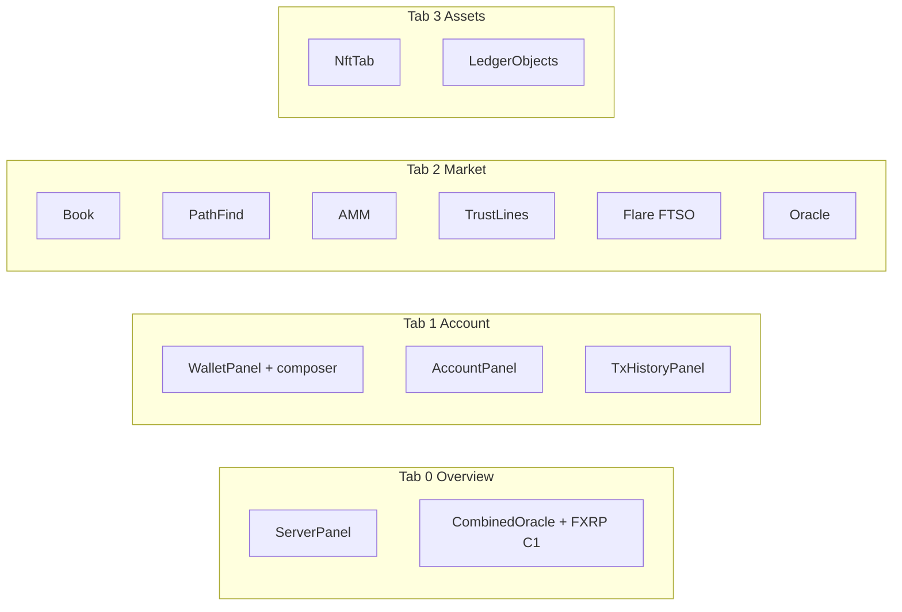
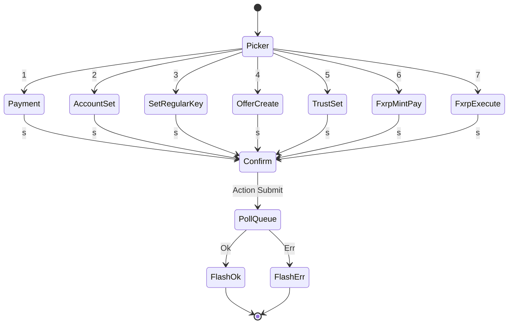
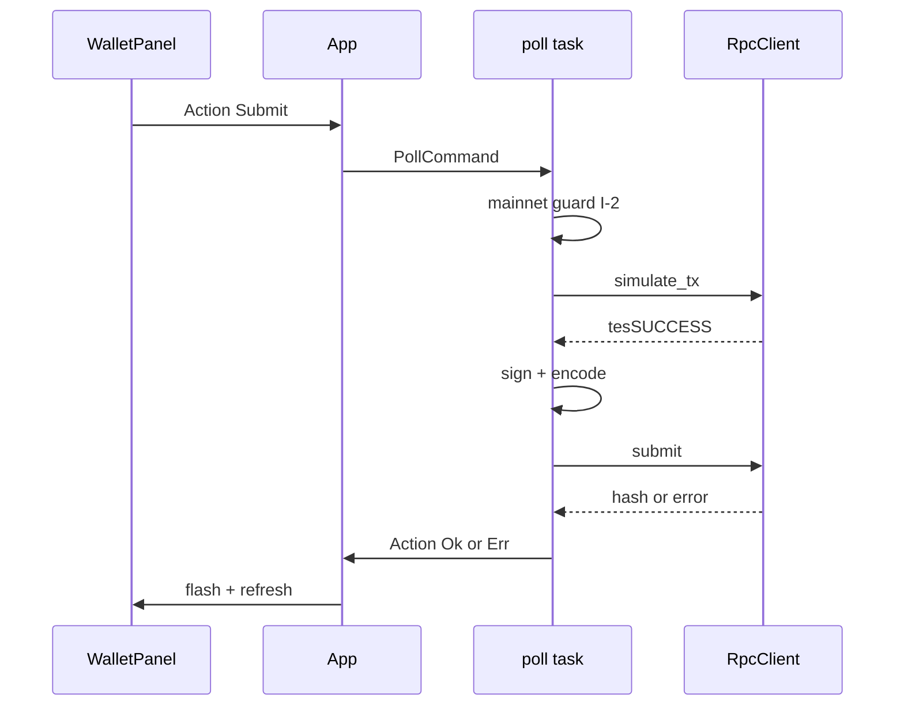
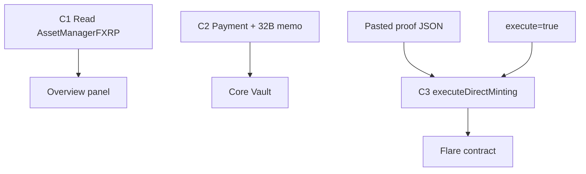

# DESIGN — UI/UX (look, feel, interaction)

**SSOT for TUI look & feel:** tabs, layout splits, focus, scrolling, modals, keybindings, colors, loading, and ratatui building blocks.

| Layer | File | Question |
|-------|------|----------|
| Requirements | [`docs/requirements.md`](docs/requirements.md) | **What** must the product do? (FR/NFR) |
| Architecture | [`docs/architecture.md`](docs/architecture.md) | **How** does the system behave? (network, config precedence, data flow, behavioral contracts → [`docs/test.md`](docs/test.md)) |
| Design (this file) | `DESIGN.md` | **How does it look and feel?** (interaction + visual language) |
| Roadmap | [`docs/roadmap.md`](docs/roadmap.md) | **What ships when?** (milestones, backlog) |

Invariants (I-1〜I-11) and review findings: [`docs/security.md`](docs/security.md) — not duplicated here.

---

## Tab map (4 tabs, I-9)



| Tab | Title | Primary panels | Layout notes |
|-----|-------|----------------|--------------|
| 0 | Overview | Server, Combined oracle/FTSO/FXRP | **44% / 56%** horizontal split (Off: server full width). `[flare] display`: full / compact / off — see architecture §6.7 |
| 1 | Account | Wallet, Account, Tx history | Wallet + composer top; account + history below |
| 2 | Market | Book, PathFind, AMM, Lines, FTSO, Oracle | Book left **62%**; path/AMM/lines stack right **38%**; FTSO + Oracle bottom **30%** |
| 3 | Assets | NFT, Ledger objects | NFT + image preview; objects / pay channels / escrows |

Guard: `TAB_TITLES.len() == panels.len() == 4` (`app.rs`, TC-060).

**Tab switching:** `Tab` / `Shift+Tab` (next/prev), number keys **`1`–`4`** (`TabJump`). Status bar shows active tab context hints where applicable.

### Flare `[flare] display` layouts (Overview / Market)

Behavioral poll rules: [`docs/architecture.md`](docs/architecture.md) §6.7.

```mermaid
flowchart TB
  subgraph full [display = full]
    OV_F[Overview 44% server | 56% combined oracle+FTSO+FXRP tables]
    MK_F[Market: full FTSO table + oracle row]
  end
  subgraph compact [display = compact]
    OV_C[Overview 44/56: oracle table + 1-line FTSO + 1-line FXRP]
    MK_C[Market: 1-line FTSO + oracle]
  end
  subgraph off [display = off]
    OV_O[Overview: server full width]
    MK_O[Market: FTSO hidden; oracle only; focus index 4 → oracle]
  end
```

| Level | Overview focus targets | Market focus targets |
|-------|------------------------|----------------------|
| `full` / `compact` | 2 (server, combined) | 6 |
| `off` | 1 (server) | 5 (FTSO slot skipped) |

---

## Global keymap

Defaults live in [`config.json5`](config.json5) under `keybindings.Splash`. User overrides merge in `~/.config/lazyxrp/config.toml` (`Config::new`, TC-026/033).

| Key | Action | Notes |
|-----|--------|-------|
| `q` | Quit | Bare `q` disabled when `keymap_suppressed` (composer/forms) |
| `Ctrl-c`, `Ctrl-d` | Quit | Always honored |
| `Ctrl-z` | Suspend | Terminal suspend |
| `Ctrl-n` | `NetworkSwitchCycle` | mainnet→testnet→devnet→xahau→xahau-test→… (session only; see architecture §6.1) |
| `r` | RefreshAccount | Debounced poll |
| `b` | RefreshBook | Debounced poll |
| `o` | RefreshLedgerObjects | Debounced poll |
| `j` / `k`, `↓` / `↑` | SelectNext / SelectPrev | Table row selection |
| `h` / `l`, `←` / `→` | FocusPrev / FocusNext | Panel focus within tab |
| `Enter` | TxDetailToggle | Opens TX detail overlay when a row is selected |
| `?` | Help | Toggles help overlay; `Esc` or `?` closes |
| `Tab` / `Shift+Tab` | TabNext / TabPrev | Hard-coded in `app.rs` (not config) |
| `1`–`4` | TabJump | Hard-coded in `app.rs` |

New global bindings: add to `config.json5` + `Action` + `app.rs` dispatch; document here and in [`docs/test.md`](docs/test.md) when user-visible.

---

## Panel-local keys

Keys below are **not** in `config.json5` unless noted. They apply when the panel has focus (or modal state as stated).

### Wallet + composer (`wallet.rs`, `wallet_composer.rs`)

| Context | Key | Effect |
|---------|-----|--------|
| Wallet table (modal closed) | `j`/`k`, arrows | Row select + scrollbar |
| Wallet table | `Enter` | TX detail overlay |
| Wallet | `t` | Open composer picker (Payment, AccountSet, SetRegularKey, OfferCreate, TrustSet, FXRP Mint, Execute) |
| Composer picker | `Tab`, `j`/`k`, arrows | Phase select (table `j`/`k` disabled while modal open) |
| AccountSet form | `Tab`, `[` `]` | Field navigation |
| AccountSet form | `e` | Edit field |
| AccountSet form | `s` | Submit queue |
| Payment form | `i` | Toggle XRP ↔ IOU |
| Payment form | `Tab`, `[` `]`, `Enter` | Field navigation |
| Payment form | `s`, `Ctrl-s` | Submit queue |
| Any submit | — | Preview: green = valid, orange = incomplete/invalid |

Column colors (wallet recent tx): hash `SECONDARY`, direction ▼ red / ▲ green / · gray, type accent, ledger muted, result success/error.

### Tx history (`tx_history.rs`)

| Key | Effect |
|-----|--------|
| `f` | Filter mode (hash or type substring); `Enter` confirm, `Esc` cancel |
| `m` | Next page when `marker` present (`TxHistoryMore`) |
| `Enter` | TX detail overlay |

### NFT (`nft.rs`)

| Key | Effect |
|-----|--------|
| `j`/`k` | Select NFT; with URI → image fetch |
| `Enter` | TX/detail as applicable |

### Tables (book, trust lines, ledger objects, path find)

| Key | Effect |
|-----|--------|
| `j`/`k`, arrows | `SelectableTableState` row select |
| `Enter` | TX detail overlay (raw JSON via `ArcValue`) |

### TX detail overlay (`tx_detail/mod.rs`)

Parser pipeline (29 types, fallback, cache): [`docs/tx-detail.md`](docs/tx-detail.md).

| Key | Effect |
|-----|--------|
| `j`/`k`, arrows | Scroll detail text |
| `Enter`, `Esc` | Close overlay |
| While open | Consumes actions so background tables do not change selection underneath |

### Server / dUNL

| Key | Effect |
|-----|--------|
| `Enter` | dUNL detail when server panel focused (Overview) |

---

## Wallet composer phases

Picker **`t`** → numeric / arrow selection.



| Phase | Action variant | Mainnet guard | Simulate-first |
|-------|----------------|---------------|----------------|
| Payment | `PaymentSubmit` | I-2 `--yes` | I-3 |
| AccountSet | `AccountSetSubmit` | I-2 | I-3 |
| SetRegularKey | `SetRegularKeySubmit` | I-2 | I-3 |
| OfferCreate | `OfferCreateSubmit` | I-2 | I-3 |
| TrustSet | `TrustSetSubmit` | I-2 | I-3 |
| FXRP C2 payment | `FxrpDirectMintPaymentSubmit` | I-2 | I-3 + 32-byte memo |
| FXRP C3 execute | `FxrpExecuteDirectMintSubmit` | I-2 + `flare.fassets.execute` | proof JSON paste |

Source: `wallet_composer.rs`, `action.rs`, `poll.rs`. Submit pipeline diagram below; network/signing rules: [`docs/architecture.md`](docs/architecture.md) §6.

---

## Submit pipeline (all wallet TX)



FXRP C3: `execute_direct_minting` via alloy when `flare.fassets.execute=true`.

---

## FXRP direct mint (visual)



Detail: [`.agents/skills/flare-fassets/direct-minting-guide.md`](.agents/skills/flare-fassets/direct-minting-guide.md).

---

## Visual language (`theme.rs`)

Royal-blue palette + turquoise secondary. **Do not** hardcode `Color::Black` on accent fills — use `CHART_VALUE_FG`.

| Token | RGB | Use |
|-------|-----|-----|
| `BORDER` / focus border | 65,105,225 | Focused panel border |
| `TITLE` | 100,149,237 | Focused panel title |
| `ACCENT` | 30,144,255 | Values, headers, selected row bg |
| `SECONDARY` | 64,224,208 | Hashes, metadata |
| `MUTED` | 119,136,153 | Unfocused chrome, dim labels |
| `SUCCESS` | 60,179,113 | Bid, inbound, tesSUCCESS |
| `ERROR` | 220,20,60 | Ask, outbound errors |
| `WARNING` | 255,165,0 | Connecting, stale |
| `FLAG` | 100,200,255 | Account flag chips |

**Panels:** `panel_block(title, is_focused)` — rounded border; focused = accent border + cornflower title; unfocused = muted.

**Tables:** `render_selectable_table` + `SelectableTableState` — header row `header_row_style()`; selected row `selected_row_style(is_focused)`.

**Status bar:** Left = connection state + freshness + optional mid price; right = network badge `format!(" {} ", name)` with reversed bold (mainnet/xahau warning coloring).

---

## Layout & focus

- **Elm-style loop:** `Event` → `Action` → `Component::update` → `draw` when `App::needs_draw` (TC-106–108).
- **Focus within tab:** `FocusNext` / `FocusPrev` cycle sub-panels; each panel sets `is_focused` on its chrome.
- **Overview:** max focus 1 when `[flare] display=off` (server only); else server + combined (2).
- **Market:** 6 focus targets (5 when Flare Off — FTSO skipped, index 4 → oracle).
- **Modal priority:** `SetKeymapSuppression(true)` while composer/forms active — global `q` does not quit (TC in `app.rs` keymap tests).

---

## Loading & empty states

| Pattern | Helper | When |
|---------|--------|------|
| Spinner + message | `render_loading` (`widgets.rs`) | Empty data, waiting on poll |
| “Not configured” | Plain `Paragraph` | Missing oracles / seed |
| Compact Flare line | `render_compact` on FTSO/FXRP panels | `[flare] display=compact` |
| Help overlay | `HelpOverlay` | `?` — lists global keys from config |

Tick-driven spinners use `Action::Tick` counter in panel state.

---

## Shared render policy

| Consumer | Helper |
|----------|--------|
| trust_lines, ledger, path_find, nft, book, dUNL, tx_history, oracle, FTSO | `render_selectable_table` |
| Dirty gating | `App::needs_draw` — user actions + data + tick (splash); actual draw clears dirty and counts FPS |

