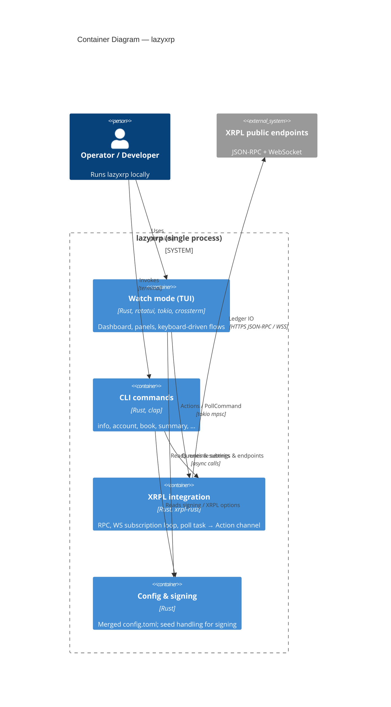

# C4 — Containers (Level 2)

lazyxrp は **1 つの Rust バイナリ**として配布される。実行時コンテナはコード境界に対応するが、それぞれ同一プロセス内で動く。

- **Watch（TUI）**: `App` / `ratatui` / `tokio` イベントループ（設計の §3）。
- **CLI ランナー**: `xrpl::execute_cli_command` 経由の非対話コマンド。
- **XRPL 統合**: `RpcClient`（`src/xrpl/client.rs`）、WebSocket（`ws.rs`）、`PollCommand` ポーリング（`poll.rs`）；入口は `src/xrpl/mod.rs` の再エクスポート。
- **設定・署名**: `Config`（既定 + `config.toml` マージ）、`SigningConfig` / シード（`src/config.rs`, `src/signing.rs`）。

コンポーネント粒度の図が必要になったら別途 Level 3 を切る。

