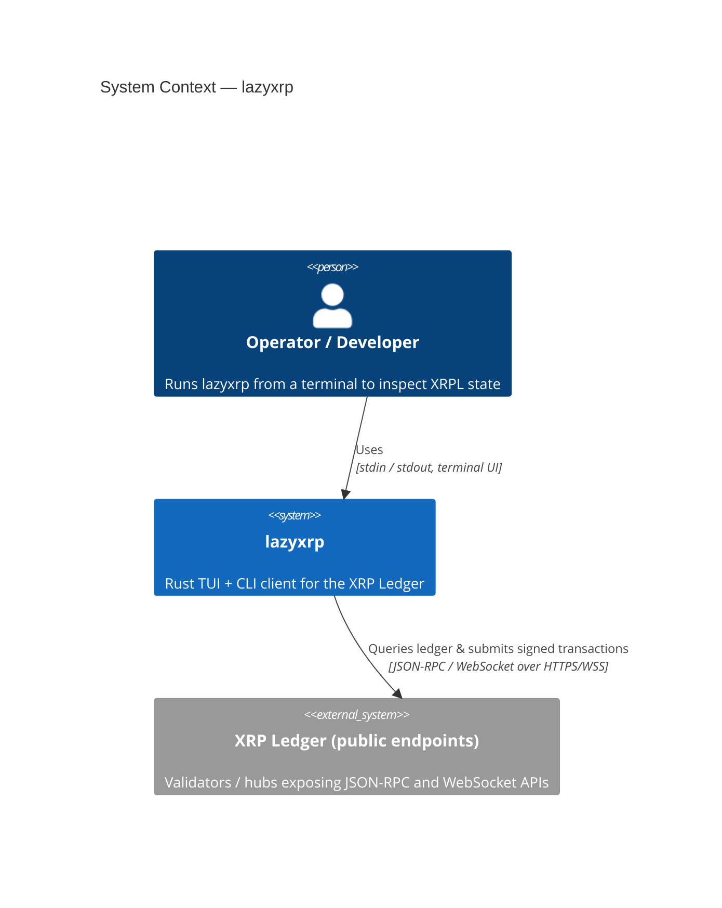

# C4 — System Context (Level 1)

lazyxrp は開発者・運用者がローカル端末から動かす **単一バイナリ**。ネットワーク上の **XRP Ledger 公開ノード**（JSON-RPC / WebSocket）へ接続し、読み取りと（設定・確認フローに応じた）署名送信を行う。

詳細な内部構造は [Container 図](./c4-containers.md) を参照。

