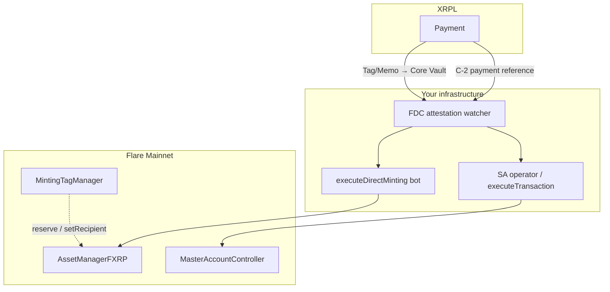

# FAssets Direct Minting — Flare Mainnet (FXRP)

**Snapshot date:** 2026-05-16  
**Authoritative source:** [Flare FAssets Operational Parameters — Direct Minting](https://dev.flare.network/fassets/operational-parameters#direct-minting)

This document is a **local checklist** for operating Tag, Memo, and Smart Account paths on **Flare Mainnet**. Values can change on-chain; always verify with `IAssetManager` / `IMintingTagManager` view calls before mainnet funds.

**lazyxrp 0.2.0+:** XRPL Direct Mint Payment (memo) + optional flagged `executeDirectMinting` (`[flare.fassets] execute=false` by default; separate `FLARE_EVM_KEY`). Still out of scope: Flare `reserve` / MintingTagManager path, `MasterAccountController.executeTransaction`, always-on executor bots. Mainnet XRPL/Flare writes need `--yes` and simulate → sign → submit.

**In-repo helpers:** [`.agents/skills/flare-fassets/direct-minting-guide.md`](../../.agents/skills/flare-fassets/direct-minting-guide.md), scripts under [`.agents/skills/flare-fassets/scripts/`](../../.agents/skills/flare-fassets/scripts/) (`DRY_RUN=true` by default).

---

## Contract resolution (never hardcode Mainnet addresses)

| Step | Call |
|------|------|
| Registry | `0xaD67FE66660Fb8dFE9d6b1b4240d8650e30F6019` (all Flare networks) |
| Asset manager | `getContractAddressByName("AssetManagerFXRP")` |
| Core Vault (XRPL destination) | `AssetManager.directMintingPaymentAddress()` |
| Tag manager | `AssetManager.getMintingTagManager()` |
| FXRP token | `AssetManager.fAsset()` |
| Smart Accounts | Resolve `MasterAccountController` etc. from registry / [Smart Accounts overview](https://dev.flare.network/smart-accounts/overview) |

Mainnet RPC example: `https://flare-api.flare.network/ext/bc/C/rpc`

---

## Mainnet parameters (FXRP / XRP) — snapshot

Re-read on-chain: `getDirectMintingMinimumFeeUBA`, `getDirectMintingFeeBIPS`, `getDirectMintingExecutorFeeUBA`, `getDirectMintingOthersCanExecuteAfterSeconds`, hourly/daily/large limits.

| Parameter | Mainnet (XRP) |
|-----------|---------------|
| Direct minting minimum fee | 0.1 XRP |
| Direct minting fee | 0.1% (BIPS on-chain) |
| Executor fee (EOA recipient) | 0.2 XRP (deducted from payment) |
| Others can execute after | 2 hours |
| Hourly limit | 4M XRP (excess → delay, not reject) |
| Daily limit | 40M XRP |
| Large minting threshold | 4M XRP |
| Large minting delay | +2 hours |
| Fee receiver | `0xF55bcAd5568d1584ab6f013f144e1e433Ee551C7` |

**Related (ordinary minting context):** `mintingCap` 70M XRP, `lotSize` 10 XRP, payment window 225 blocks / 15 min (avg 4s/block). See full [operational parameters](https://dev.flare.network/fassets/operational-parameters).

### Tag / Minting Tag Manager (Mainnet)

| Parameter | Value |
|-----------|-------|
| Reservation fee | 100 FLR (`MintingTagManager.reservationFee()`) |
| NFT name / symbol | FXRP Minting Tag / MTFXRP |
| Reserved tag count (initial offset) | 30 |

### Fee deduction (EOA recipient paths: Tag & Memo)

```text
mintingFee = max(minimumFeeUBA, amountUBA × feeBIPS / 10_000)
netForMint ≈ amountUBA − mintingFee − executorFeeUBA
```

If payment is too small, minting does not proceed (`amountUBA < minimumFeeUBA`). Practical floor for a paid executor: **≥ minimumFee + executorFee** (Mainnet snapshot ≈ **0.3 XRP** before lot-size rules).

**Example:** 10 XRP payment → mintingFee = 0.1 XRP, executor = 0.2 XRP → ~9.7 XRP equivalent minted (UBA rounding applies).

**Smart Account recipient:** executor compensation is calculated and paid by the Smart Account manager per protocol rules — do not assume the same “0.2 XRP from payment” model without reading current AssetManager restrictions.

---

## Path overview

| Path | XRPL | Flare setup | Flare completion | Best for |
|------|------|-------------|------------------|----------|
| **A — Tag** | `Payment` → Core Vault + `DestinationTag` | `reserve` + `setMintingRecipient` (+ optional `setAllowedExecutor`) | `executeDirectMinting` | Repeat mints, fixed recipient |
| **B — Memo** | `Payment` → Core Vault + fixed `MemoData` | None | `executeDirectMinting` | One-shot, no 100 FLR |
| **C-1 — SA as recipient** | Same as A or B | Recipient = Smart Account address | `executeDirectMinting` | FXRP to SA; user may hold no FLR on Flare |
| **C-2 — SA protocol** | `Payment` to hub + **payment reference** bytes | None (user) | `MasterAccountController.executeTransaction` | End users with XRPL only; operator required |

---

## Path A — Destination Tag

Official guide: [Direct minting with a tag](https://dev.flare.network/fassets/developer-guides/fassets-direct-minting-tag)

### Flare (first-time setup)

1. `MintingTagManager.reserve()` — payable **100 FLR** → `tagId` (caller = owner, initial recipient).
2. `setMintingRecipient(tagId, recipient)` — EOA or Smart Account (C-1).
3. Optional: `setAllowedExecutor(tagId, executor)` — **not** `address(0)`; effective after **10 minutes**.
4. Read `directMintingPaymentAddress()` for Core Vault XRPL address.

### XRPL (every mint)

- `Destination` = Core Vault (from step 4).
- `DestinationTag` = `tagId` (uint32).
- `Amount` = drops for intended XRP (include fee headroom).

### Completion

- After FDC attestation: preferred executor calls `executeDirectMinting` within **2 hours**, or anyone can after that.
- Events: `DirectMintingExecuted`, `DirectMintingDelayed` (limits / large mint).

### Repeat mints

Only XRPL `Payment` with same tag. Change recipient/executor on Flare only when needed (`setAllowedExecutor` → wait 10 min again).

### Pitfalls

- Transferring the tag NFT resets recipient and clears executor.
- Do not mix Memo encoding on the same payment as Tag path.

**Script:** `direct-mint-fxrp-tag.ts` — env: `RECIPIENT`, `AMOUNT_XRP`, `EXISTING_TAG_ID`, `PRIVATE_KEY`, `XRPL_SEED`, `DRY_RUN`.

---

## Path B — Memo (one-shot)

Official guide: [Direct minting with a memo](https://dev.flare.network/fassets/developer-guides/fassets-direct-minting)

### 32-byte memo (recipient only; open execution after 2h)

```text
MemoData (hex, lowercase, no 0x prefix):
4642505266410018 + 00000000 + <recipient 40 hex chars>
```

Prefix `4642505266410018` = `DIRECT_MINTING`.

### 48-byte memo (recipient + executor)

```text
4642505266410021 + <recipient 40 hex> + <executor 40 hex>
```

Prefix `4642505266410021` = `DIRECT_MINTING_EX`. Executor `000…000` (20 bytes) → anyone may execute after timeout (same as 32-byte semantics).

### XRPL

```json
{
  "TransactionType": "Payment",
  "Destination": "<CoreVault>",
  "Amount": "<drops>",
  "Memos": [{ "Memo": { "MemoData": "<hex from above>" } }]
}
```

No `DestinationTag` on Memo path.

### Completion

Same as Path A: FDC proof → `executeDirectMinting`. Monitor 2h fallback if using 32-byte or zero executor.

**Script:** `direct-mint-fxrp.ts` — env: `RECIPIENT`, `AMOUNT_XRP`, `XRPL_SEED`, `DRY_RUN`.

---

## Path C — Smart Account

Overview: [Smart Accounts](https://dev.flare.network/smart-accounts/overview). Byte layout for payment references is **SSOT on Flare docs** and `flare-hardhat-starter` examples — never generate memos with an LLM.

### C-1 — Direct minting with SA as recipient

Use Path A or B, but set `recipient` / memo recipient to the **Smart Account Flare address**.

- XRPL still pays **Core Vault** (not the user’s XRPL address on Flare).
- Completion still **`executeDirectMinting`** with AssetManager rules for SA recipients.
- Map XRPL sender → SA address before production (creation may happen on first `executeTransaction` in other flows).

### C-2 — Smart Account protocol (XRPL-only user)

1. User sends XRPL `Payment` to the **Smart Account hub address** with a fixed **payment reference** (binary memo), not free text.
2. Supported instruction types (skill snapshot): `0` = FXRP, `1` = Firelight, `2` = Upshift (leading nibble / protocol-defined layout).
3. Operator: obtain FDC proof → `MasterAccountController.executeTransaction(proof, xrplAddress)`.
4. Controller gets or creates SA, decodes reference, runs instruction (e.g. mint FXRP).

User needs **no FLR**; operator pays gas and runs infrastructure.

### C-1 vs C-2

| | C-1 | C-2 |
|--|-----|-----|
| XRPL destination | Core Vault | SA hub (per deployment) |
| Flare finalization | `executeDirectMinting` | `executeTransaction` |
| Your infra | FAssets executor | SA operator + FDC |

---

## Production stack (all three paths)



| Component | Tag / Memo (A, B, C-1) | SA protocol (C-2) |
|-----------|------------------------|-------------------|
| Mainnet Flare RPC | Required | Required |
| XRPL node / WS | Required | Required |
| `executeDirectMinting` | Required | Not used |

**Coston2 executor skeleton:** [`execute-direct-mint.ts`](../../.agents/skills/flare-fassets/scripts/execute-direct-mint.ts) — see [monitoring doc](fassets-direct-mint-monitoring.md#executor-skeleton-coston2).
| `executeTransaction` operator | Optional (unless C-1 only) | **Required** |
| FDC / proofs | Required | Required |
| 100 FLR (tag reserve) | Path A only | No |

---

## Go-live checklist (Mainnet)

### Phase 0 — Read chain state

- [ ] Resolve `AssetManagerFXRP`, Core Vault, all `getDirectMinting*`
- [ ] If Tag: `reservationFee()` = 100 FLR
- [ ] If C-2: resolve `MasterAccountController` and hub address from registry

### Phase 1 — Testnet E2E

- [ ] Same path on **Coston2** with scripts (`DRY_RUN` then explicit live)
- [ ] Small Mainnet amount (e.g. 10–20 XRP) for chosen path(s)
- [ ] Confirm FXRP balance on Flare explorer

### Phase 2 — Operations

- [ ] **Monitoring deployed first** — see [`fassets-direct-mint-monitoring.md`](fassets-direct-mint-monitoring.md) (watchers, FDC, executor/SA operator, alerts)
- [ ] Executor monitors **2h** window (`DirectMintingExecuted` / `DirectMintingDelayed`)
- [ ] Amounts **≥ 4M XRP** plan for **+2h** delay
- [ ] Hourly/daily caps understood as **delay**, not hard fail
- [ ] Core Vault / controller addresses loaded at runtime only

### Phase 3 — lazyxrp boundary

- [ ] XRPL `Payment` validated in lazyxrp if used; Flare txs via separate tooling
- [ ] Mainnet writes: `--yes`, simulate → sign → submit (I-2, I-3)

---

## Quick reference — memo hex

| Variant | Length | Prefix (hex) |
|---------|--------|----------------|
| Recipient only | 32 bytes | `4642505266410018` + `00000000` + recipient |
| Recipient + executor | 48 bytes | `4642505266410021` + recipient + executor |

---

## Further reading

- [FAssets minting](https://dev.flare.network/fassets/minting)
- [FAssets redemption](https://dev.flare.network/fassets/redemption)
- [Core Vault](https://dev.flare.network/fassets/core-vault)
- [FXRP token interactions](https://dev.flare.network/fxrp/token-interactions/fxrp-address)
- Repo skill: [flare-fassets/SKILL.md](../../.agents/skills/flare-fassets/SKILL.md)
