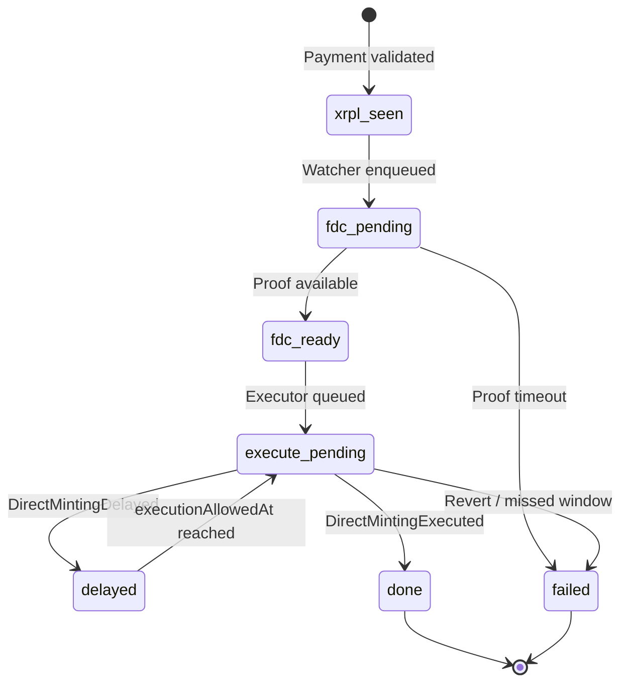

# FAssets Direct Minting — monitoring & alerts (Mainnet)

**Snapshot date:** 2026-05-16  
**Companion:** [`fassets-direct-mint-mainnet.md`](fassets-direct-mint-mainnet.md) (paths, parameters, go-live)  
**Authoritative source:** [Flare FAssets](https://dev.flare.network/fassets/overview), [Smart Accounts](https://dev.flare.network/smart-accounts/overview)

This document defines **what to watch**, **when to page**, and **how to correlate** Tag (A), Memo (B), Smart Account recipient (C-1), and Smart Account protocol (C-2) on **Flare Mainnet**. It is operator-facing; lazyxrp does not run these jobs today.

---

## Monitoring goals

| Goal | Why |
|------|-----|
| **Finalize before competitor** | After `othersCanExecuteAfterSeconds` (Mainnet **2h**), anyone can call `executeDirectMinting` — you lose executor fee |
| **Never miss delayed mints** | Rate limits emit `DirectMintingDelayed` with `executionAllowedAt` — still success path |
| **Prove XRPL → Flare chain** | Users care about FXRP balance; ops cares about proof + execute latency |
| **Split C-2 operator** | SA protocol uses `MasterAccountController.executeTransaction`, not AssetManager direct mint |

---

## Roles (deploy all three for “full set”)

| Role | Paths | Responsibility |
|------|-------|----------------|
| **XRPL watcher** | A, B, C-1, C-2 | Detect validated `Payment` to Core Vault (A/B/C-1) or SA hub (C-2); match tag/memo/reference |
| **FDC / proof worker** | All | Request / wait for Payment attestation; hand proof to Flare submitter |
| **Direct-mint executor** | A, B, C-1 | Call `AssetManager.executeDirectMinting(proof)` within SLA |
| **SA operator** | C-2 | Call `MasterAccountController.executeTransaction(proof, xrplAddress)` within SLA |
| **Parameter poller** | All | Daily (or on alert): refresh `getDirectMinting*`, Core Vault address, limits |

One process may combine roles; **alerting must still tag which role failed**.

---

## Correlation ID: mint job

Track every user payment as a **mint job** keyed by **XRPL transaction hash** (unique).

| Field | Source |
|-------|--------|
| `job_id` | XRPL tx hash |
| `path` | `tag` \| `memo32` \| `memo48` \| `sa_recipient` \| `sa_protocol` |
| `xrpl_account` | Payer `Account` |
| `amount_drops` | `Amount` |
| `destination` | Must match runtime Core Vault or SA hub |
| `destination_tag` | Path A only |
| `memo_data_hex` | Path B / C-2 |
| `flare_recipient` | Decoded from tag manager, memo, or SA mapping |
| `preferred_executor` | Tag `allowedExecutor`, memo48 bytes 21–40, or null |
| `xrpl_validated_at` | Ledger close time |
| `fdc_proof_ready_at` | When proof object is buildable |
| `execution_allowed_at` | From `DirectMintingDelayed` or computed (limits / large mint) |
| `flare_tx_hash` | `executeDirectMinting` or `executeTransaction` |
| `terminal_event` | e.g. `DirectMintingExecuted` |

Persist jobs in your queue DB / sheet — **do not rely on logs alone**.

---

## State machine (paths A / B / C-1)



| State | Meaning | Typical owner |
|-------|---------|---------------|
| `xrpl_seen` | Payment validated on XRPL, job row created | XRPL watcher |
| `fdc_pending` | Waiting for FDC Payment proof | FDC worker |
| `fdc_ready` | Proof ready, not yet submitted on Flare | FDC worker |
| `execute_pending` | Eligible to call `executeDirectMinting` | Executor |
| `delayed` | `DirectMintingDelayed` or computed wait (limits / ≥4M XRP) | Executor (scheduled) |
| `done` | `DirectMintingExecuted` observed | Executor |
| `failed` | Terminal error (see runbook) | On-call |

**C-2 (SA protocol):** same `xrpl_seen` → `fdc_*`, then `sa_execute_pending` → `done` on successful `executeTransaction` (confirm exact success log/event from [Smart Accounts overview](https://dev.flare.network/smart-accounts/overview) and your starter ABI — do not guess event names in production).

---

## Timeline & SLAs (Mainnet snapshot)

Use these as **alert thresholds**, not guarantees. Re-read `getDirectMintingOthersCanExecuteAfterSeconds()` on-chain.

| Milestone | Target (normal) | Warn | Page (P0) |
|-----------|-----------------|------|-----------|
| XRPL validated → job created | &lt; 2 min | &gt; 5 min | &gt; 15 min (watcher down) |
| XRPL validated → FDC proof ready | &lt; 30 min | &gt; 2 h | &gt; 12 h (attestation window risk) |
| Proof ready → `executeDirectMinting` mined | &lt; 15 min | &gt; 45 min | &gt; **1 h 45 min** (before public 2h window) |
| Still not executed | — | T+**1h 30m** since validated | T+**1h 55m** (competitor can take fee) |
| After `executionAllowedAt` (delayed) | Execute within 15 min | +30 min | +2 h (stuck delayed) |
| End-to-end (XRPL → `DirectMintingExecuted`) | &lt; 2 h | &gt; 4 h | &gt; 24 h |

**Large mint (≥ 4M XRP):** add **+2 h** to `executionAllowedAt` — schedule executor, do not page as “stuck” until that timestamp + grace.

**Hourly / daily caps:** excess volume **delays**; watch `DirectMintingDelayed`, not failed XRPL.

---

## Flare events (subscribe on `AssetManagerFXRP`)

Resolve contract address at runtime via Registry. Index from deployment block or use a managed indexer.

| Event | When | Action |
|-------|------|--------|
| **`DirectMintingExecuted`** | Mint finalized | Mark job `done`; record minted amount / recipient from args |
| **`DirectMintingDelayed`** | Rate limit or large mint | Set `execution_allowed_at`; reschedule executor; **info** alert |
| *(governance)* **`unblockDirectMintingsUntil`** | Manual unblock | Ops note only; adjust delayed queue |

**MintingTagManager** (path A ops):

| Event / call | When | Action |
|--------------|------|--------|
| `reserve` success | New tag | Log `tagId`, owner, link to Flare tx |
| `setMintingRecipient` | Recipient change | Update tag → recipient map |
| `setAllowedExecutor` | Executor binding | Remember **10 min** cooldown before exclusive execute |
| Tag NFT transfer | Ownership change | **Warn:** recipient reset, executor cleared |

Confirm exact event ABI from [IAssetManager](https://dev.flare.network/fassets/reference/IAssetManager) / deployed artifact on Mainnet.

---

## XRPL watches

### Path A / B / C-1 (Core Vault)

| Check | Rule |
|-------|------|
| Destination | Equals `directMintingPaymentAddress()` (refresh daily) |
| Path A | `DestinationTag` maps to known `tagId`; recipient matches `mintingRecipient(tagId)` |
| Path B | `MemoData` decodes to 32B or 48B prefix (`4642505266410018` / `4642505266410021`) |
| Amount floor | `amountUBA >= getDirectMintingMinimumFeeUBA()` or flag **non-mintable** (user error) |
| Duplicate | Same hash → idempotent ignore |

Subscribe: `account_tx` on Core Vault **or** streams (`transactions` filtered) — prefer validated ledger only.

### Path C-2 (SA protocol)

| Check | Rule |
|-------|------|
| Destination | SA hub address from registry / docs (not Core Vault) |
| Memo | Fixed **payment reference** layout per [Smart Accounts overview](https://dev.flare.network/smart-accounts/overview) — validate prefix / instruction type (`0` = FXRP) |
| Handoff | Enqueue **SA operator** queue, not direct-mint executor |

---

## FDC / proof layer

| Check | Frequency | Alert |
|-------|-----------|-------|
| Proof request success rate | Per job | Fail after N retries → P1 |
| Proof latency p95 | Rolling 24h | &gt; 2h → P2 |
| Attestation window | Config `attestationWindowSeconds` (see [operational parameters](https://dev.flare.network/fassets/operational-parameters)) | Job older than window without proof → P0 |

Store: `proof_round_id`, `proof_bytes_hash`, `requested_at`, `ready_at`.

---

## Executor & operator health

| Signal | Path | Warn | Page |
|--------|------|------|------|
| Flare RPC error rate | All | &gt; 5% 5m | &gt; 20% 5m |
| Executor wallet FLR balance | A/B/C-1 | &lt; 5 FLR | &lt; 1 FLR |
| Operator wallet FLR balance | C-2 | &lt; 5 FLR | &lt; 1 FLR |
| Nonce stuck / tx pool | All | Same nonce &gt; 10 min | &gt; 30 min |
| Jobs in `execute_pending` | A/B/C-1 | &gt; 0 aged &gt; 1h 30m | &gt; 1h 55m |
| Jobs in `sa_execute_pending` | C-2 | Same SLA as above | Same |
| Competitor won execute | A/B/C-1 | Log when `msg.sender != our_executor` on success | Trend &gt; 5/day → P2 |

**Tag-only:** after `setAllowedExecutor`, suppress “unauthorized execute” alerts for **10 minutes**.

---

## Alert severity

| Sev | Example | Response |
|-----|---------|----------|
| **P0** | Watcher down; proof past attestation window; &lt; 5 min to public execute window with no tx | Page on-call |
| **P1** | Proof retries exhausted; execute reverted | Fix within 1h |
| **P2** | `DirectMintingDelayed` (expected); high p95 latency | Next business day |
| **P3** | Parameter drift vs snapshot doc | Update doc / config |

---

## Dashboards (minimum panels)

1. **Pipeline funnel** — counts by state (`xrpl_seen` … `done`) per path  
2. **Age histogram** — time in `fdc_pending` and `execute_pending`  
3. **Delayed queue** — jobs with `execution_allowed_at` in the future  
4. **Executor race** — mints finalized by preferred vs other sender  
5. **XRPL ingress** — payments/hour to Core Vault vs SA hub  
6. **Wallet gas** — executor + operator FLR  

---

## Runbook (symptom → action)

| Symptom | Likely cause | Action |
|---------|--------------|--------|
| XRPL ok, no Flare event | FDC backlog or wrong destination | Verify dest = Core Vault; check FDC dashboard; re-request proof |
| `DirectMintingDelayed` only | Hourly/daily/large limit | Wait until `executionAllowedAt`; do not resend XRPL |
| Execute reverts | Stale proof, wrong tag/memo decode | Re-decode memo/tag; rebuild proof from correct ledger index |
| Someone else executed | Missed 2h SLA | Post-mortem executor latency; tighten T+1h30m warn |
| Amount too small | Below `minimumFeeUBA` | Mark job failed (user); no execute |
| Tag mint to wrong recipient | `setMintingRecipient` not called or tag transferred | Fix mapping; **never** execute until recipient matches policy |
| C-2 only: SA not created | Operator never called `executeTransaction` | Run operator with proof + xrpl address |
| FXRP balance wrong on Flare | Wrong recipient in memo/tag | Trace decode pipeline; user support |

---

## Pre-mainnet monitoring checklist

Deploy **before** first Mainnet XRP:

- [ ] XRPL watcher: Core Vault + (if C-2) SA hub addresses from chain  
- [ ] Flare log subscription: `DirectMintingExecuted`, `DirectMintingDelayed` on resolved `AssetManagerFXRP`  
- [ ] Job store + idempotency on XRPL hash  
- [ ] FDC worker with retry + timeout aligned to attestation window  
- [ ] Executor bot with clock sync (NTP)  
- [ ] Alerts: T+1h30m / T+1h55m execute pending; FLR low; RPC errors  
- [ ] SA operator queue (if C-2) separate from direct-mint executor  
- [ ] Daily cron: refresh `directMintingPaymentAddress()` and `getDirectMinting*`  
- [ ] Runbook linked in on-call wiki  
- [ ] Coston2 dry run: one job through all states with test amounts  
- [ ] Executor skeleton tested: [`execute-direct-mint.ts`](../../.agents/skills/flare-fassets/scripts/execute-direct-mint.ts) — `npm test`（TC-090/091）、`EXECUTOR_MODE=watch`、続けて `execute` + `DRY_RUN=false`

---

## Executor skeleton (Coston2)

Minimal viem operator in the repo (not lazyxrp). Defaults to **DRY_RUN** and **Coston2** RPC.

| `EXECUTOR_MODE` | Purpose |
|-----------------|--------|
| `watch` | Poll `DirectMintingExecuted` / `DirectMintingDelayed` on `AssetManagerFXRP` |
| `execute` | FDC Payment proof → `executeDirectMinting` |

```bash
cd .agents/skills/flare-fassets/scripts
npm install

# 0) Vitest — `normalizeTxId` / `resolveWatchStartBlock`（TC-090/091）
npm test

# 1) Event tail (no keys; uses viem + tsx)
EXECUTOR_MODE=watch npx tsx execute-direct-mint.ts

# 2) Dry-run finalize
XRPL_TX_HASH=<64-hex> VOTING_ROUND_ID=<fdc-round> \
  COSTON2_DA_LAYER_URL=... VERIFIER_URL_TESTNET=... VERIFIER_API_KEY_TESTNET=... \
  npx tsx execute-direct-mint.ts

# 3) Submit (Coston2 only — fund executor with C2FLR)
DRY_RUN=false PRIVATE_KEY=0x... \
  XRPL_TX_HASH=... VOTING_ROUND_ID=... \
  npx tsx execute-direct-mint.ts
```

Wire **XRPL watcher → job row → FDC round discovery → this script** in your operator service; the skeleton does not poll XRPL or discover voting rounds automatically.

---

## lazyxrp boundary

| Capability | lazyxrp | Monitoring stack |
|------------|---------|------------------|
| Detect XRPL `Payment` | Can watch accounts user configures | Dedicated watcher on Core Vault / hub |
| Build tag/memo | Manual / scripts | Decoder unit tests against golden hex |
| `executeDirectMinting` / `executeTransaction` | **No** | viem/ethers operator service |
| Alerting | **No** | PagerDuty / Slack / your choice |

---

## Further reading

- [`fassets-direct-mint-mainnet.md`](fassets-direct-mint-mainnet.md)  
- [Operational parameters](https://dev.flare.network/fassets/operational-parameters#direct-minting)  
- [Direct minting guide (repo)](../../.agents/skills/flare-fassets/direct-minting-guide.md)  
- Scripts: [`direct-mint-fxrp-tag.ts`](../../.agents/skills/flare-fassets/scripts/direct-mint-fxrp-tag.ts), [`direct-mint-fxrp.ts`](../../.agents/skills/flare-fassets/scripts/direct-mint-fxrp.ts), [`execute-direct-mint.ts`](../../.agents/skills/flare-fassets/scripts/execute-direct-mint.ts)
