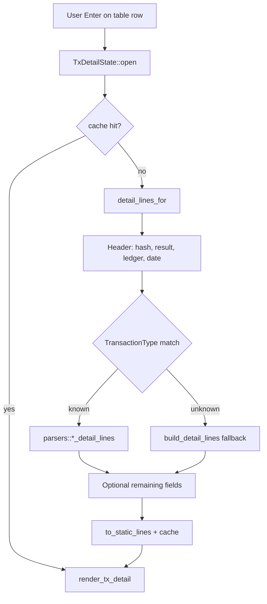

# Transaction detail overlay (`tx_detail/`)

Human-oriented guide for the scrollable TX detail popup. Structural rules (ArcValue immutability, component boundaries) live in [`agent/DATA_MODEL.md`](agent/DATA_MODEL.md) and [`agent/INVARIANTS.md`](agent/INVARIANTS.md).

## Entry points

| Symbol | File | Role |
|--------|------|------|
| `TxDetailState` | `src/components/shared/tx_detail/mod.rs` | Visibility, scroll, line cache |
| `render_tx_detail` | same | Layout, popup chrome, scrollbar |
| `detail_lines_for` | same | Build `Vec<Line>` from tx + meta JSON |
| `TX_DETAIL_PARSERS` / `typed_detail_lines` | `parsers.rs` | Registration table + dispatch (single source) |
| `*_detail_lines` (×29) | `parsers.rs` | Per-`TransactionType` typed sections |
| `push_common_lines`, `format_value` | `format.rs` | Shared formatting helpers |

Panels that open the overlay pass `ArcValue` tx/meta JSON from row types (`TxRow`, `OfferRow`, etc.). See [`design.md`](design.md) § TUI panels.

## Pipeline

1. **Header** — Always shown from raw JSON (`hash`, `TransactionResult`, `ledger_index`, `date`).
2. **Typed branch** — `typed_detail_lines` looks up `TransactionType` in `TX_DETAIL_PARSERS` and calls the parser. Returns `None` → skip to fallback.
3. **Fallback** — `build_detail_lines` walks known field names, then dumps unlisted keys via `format_value`.
4. **Cache** — First open per TX builds `cached_lines`; scroll only adjusts offset (see [`agent/DESIGN_ISSUES.md`](agent/DESIGN_ISSUES.md) Issue 9 note).

## Supported transaction types (29)

Dispatch is via `TX_DETAIL_PARSERS` in `parsers.rs` (one row per type):

`Payment`, `AccountSet`, `TrustSet`, `OfferCreate`, `OfferCancel`, `NFTokenMint`, `NFTokenBurn`, `NFTokenCreateOffer`, `NFTokenAcceptOffer`, `NFTokenCancelOffer`, `CheckCreate`, `CheckCash`, `CheckCancel`, `SignerListSet`, `SetRegularKey`, `DepositPreauth`, `EscrowCreate`, `EscrowFinish`, `EscrowCancel`, `PaymentChannelCreate`, `PaymentChannelFund`, `PaymentChannelClaim`, `AMMCreate`, `AMMDeposit`, `AMMWithdraw`, `AMMVote`, `AMMBid`, `AMMDelete`, `TicketCreate`.

**Parser count:** 29 — keep in sync with [`agent/DESIGN_ISSUES.md`](agent/DESIGN_ISSUES.md) Issue 9 and the match arm in `mod.rs` when adding types.

## Changing this subsystem

| Change | Touch |
|--------|--------|
| New `TransactionType` | `parsers.rs` (new `*_detail_lines` + `TX_DETAIL_PARSERS` row), this list, Issue 9 |
| New shared field label | `format.rs` or `push_common_lines` |
| Performance | `TxDetailState::cached_lines` only — avoid per-frame `detail_lines_for` without cache |
| Cross-module amount formatting | Note `fmt_xrpl_amount` → `client::drops_to_xrp` (graph INFERRED edge) |

Run `graphify update .` after edits under `src/components/shared/tx_detail/`.

## graphify hub nodes

High-centrality symbols (see [`graphify-out/GRAPH_REPORT.md`](../graphify-out/GRAPH_REPORT.md) § God Nodes): `detail_lines_for`, `build_detail_lines`, `push_common_lines`, `dim_style`, `accent_style`, `WalletPanel`.
